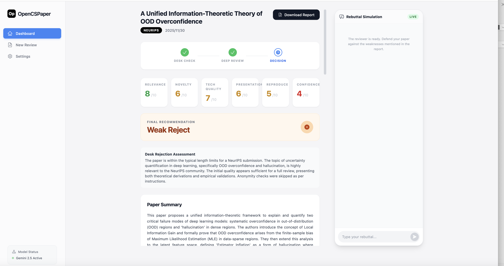

<div align="center">

</div>

<div align="center">
  <h1>OpenCSPaper - 你的 AI 论文审稿助手</h1>
  <p>
    <strong>利用 LLM 加速您的计算机科学论文审稿流程。</strong>
  </p>
  <p>
    <a href="https://github.com/imbue-bit/OpenCSPaper/issues">报告 Bug</a>
    ·
    <a href="https://github.com/YOUR_USERNAME/OpenCSPaper/issues">提出新特性</a>
  </p>
</div>

---

## 📖 项目简介

**OpenCSPaper** 是一款专为计算机科学领域的研究者、学生和审稿人设计的 AI 论文审稿服务。你是否曾为繁琐的论文审阅工作感到头疼？OpenCSPaper 旨在通过先进的生成式 AI 技术，为你提供快速、全面、富有洞见的论文分析报告，让你的审稿工作事半功倍。

我们的目标是成为你最得力的学术研究伙伴，将你从重复性劳动中解放出来，专注于更具创造性的思考。

## 快速开始

想要在本地运行 OpenCSPaper？只需简单的几步。

### 先决条件

*   **Node.js**: v18 或更高版本
*   **Git**: 用于克隆项目仓库

### 本地部署指南

1.  **克隆仓库**
    ```bash
    git clone https://github.com/imbue-bit/OpenCSPaper.git
    cd OpenCSPaper
    ```

2.  **安装依赖**
    使用 `npm` (或 `yarn`, `pnpm`) 安装项目所需的依赖包。
    ```bash
    npm install
    ```

3.  **配置 API 密钥**
    *   将 `.env.local.example` 文件复制并重命名为 `.env.local`。
    *   打开 `.env.local` 文件，将你的 [Google Gemini API Key](https://aistudio.google.com/app/apikey) 填入其中。
      ```dotenv
      # .env.local
      GEMINI_API_KEY="在这里填入你的API密钥"
      ```

4.  **启动应用**
    运行以下命令，启动本地开发服务器。
    ```bash
    npm run dev
    ```
    现在，在浏览器中打开 `http://localhost:3000` 即可访问你的 OpenCSPaper 应用！

## 💡 如何使用

1.  访问应用主页。
2.  点击“上传论文”按钮，选择一个 PDF 格式的 CS 论文文件。
3.  稍等片刻，AI 将开始阅读和分析论文。
4.  分析完成后，页面上会展示一份详细的审稿报告，包括论文的各项评估。

## 🤝 贡献指南

我们非常欢迎来自社区的贡献！无论是修复 bug、增加新功能还是改进文档，都对 OpenCSPaper 项目至关重要。

如果你想参与贡献，请：
1.  Fork 本仓库
2.  创建你的特性分支 (`git checkout -b feature/AmazingFeature`)
3.  提交你的更改 (`git commit -m 'Add some AmazingFeature'`)
4.  将你的分支推送到远程仓库 (`git push origin feature/AmazingFeature`)
5.  创建一个 Pull Request
